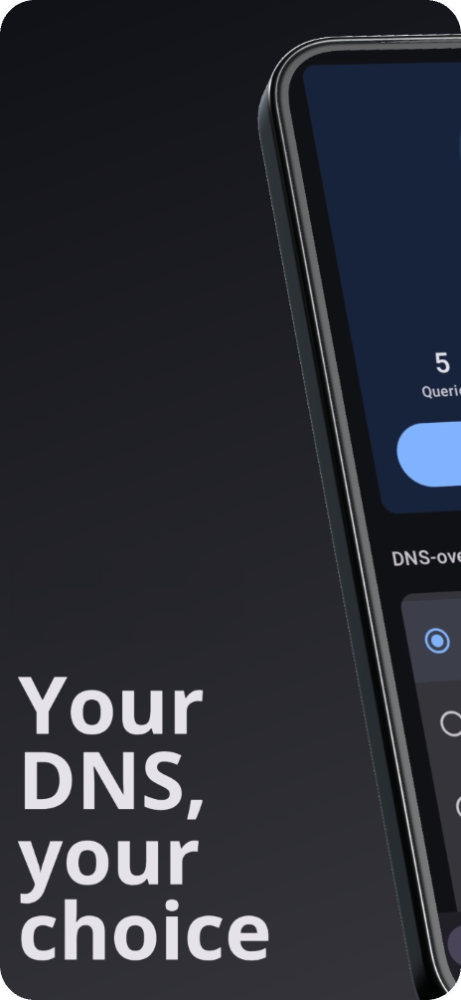
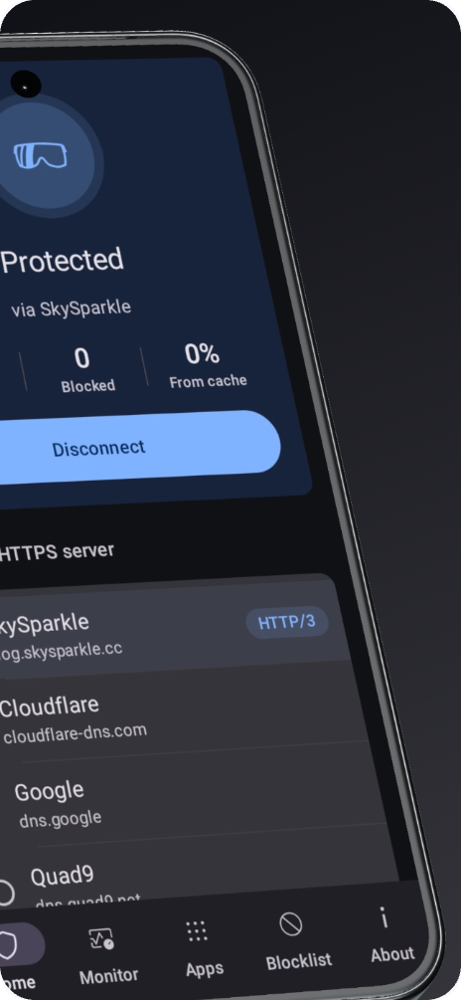
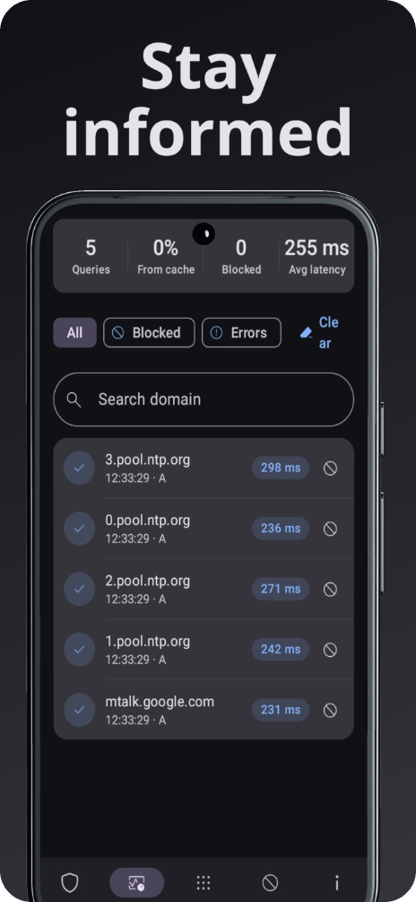
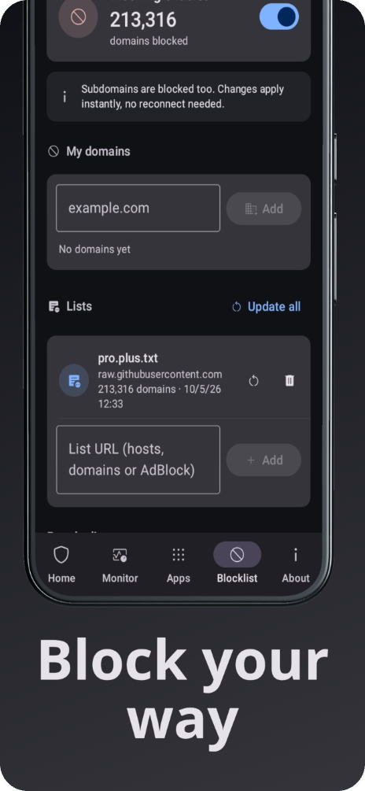
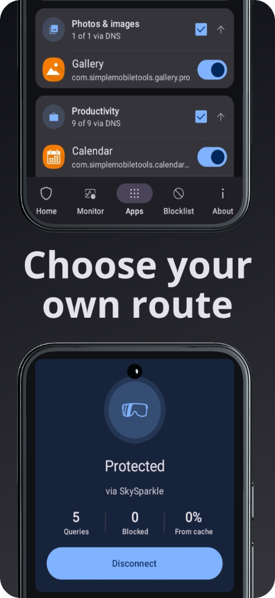

<p align="center">
  
</p>

<h1 align="center">SparkleDns</h1>

<p align="center">
  <a href="https://github.com/kalarina-bit/Sparkledns/releases"></a>
</p>

<p align="center">
  
</p>

**Lightweight DNS-over-HTTPS client for Android** (Kotlin, Jetpack Compose).

The app starts a local VPN that captures only DNS traffic and forwards every query to the selected DoH server (RFC 8484) — everything else goes through your normal connection.

## Features

- 🔌 **One-tap connect/disconnect**, with a Quick Settings tile
- 🔄 **Switch servers on the fly** — the tunnel restarts automatically
- 🚀 **Built-in server test** showing protocol and latency
- 📊 **Live query monitor** with stats, filters and one-tap blocking
- 📱 **Per-app DNS** — chosen apps bypass the tunnel
- 🚫 **Custom blocklists** — your own domains plus hosts/domain/AdBlock lists by URL (HaGeZi Pro++ and TIF presets)
- 🔓 **No analytics, no Google Play Services**

## Screenshots

<p align="center">
  
  
  
  
  
</p>

## Installation


1. Download the APK for the version you want from the [Releases page](https://github.com/kalarina-bit/Sparkledns/releases).
2. On your Android device, allow installs from unknown sources for the app you use to open the file (Settings → Apps → Special access → Install unknown apps).
3. Open the downloaded `.apk` file and confirm the install.

## Verifying a download


Compare the SHA-256 checksum of the downloaded APK against the value shown for that version on the [Releases page](https://github.com/kalarina-bit/Sparkledns/releases):

```sh
sha256sum Sparkledns-vX.X.X.apk
```

## Repository structure


```
.
├── assets/              # Icon images
│   └── screenshots/     # App screenshots
├── LICENSE              # GNU GPLv3
└── README.md
```

APK builds are published as assets on the [Releases page](https://github.com/kalarina-bit/Sparkledns/releases), not stored in this repository.

## License

This project is licensed under the **GNU General Public License v3.0** — see the [LICENSE](LICENSE) file for details.
